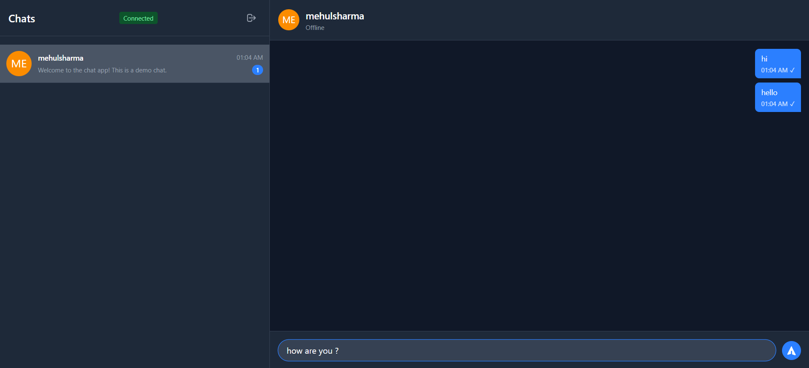
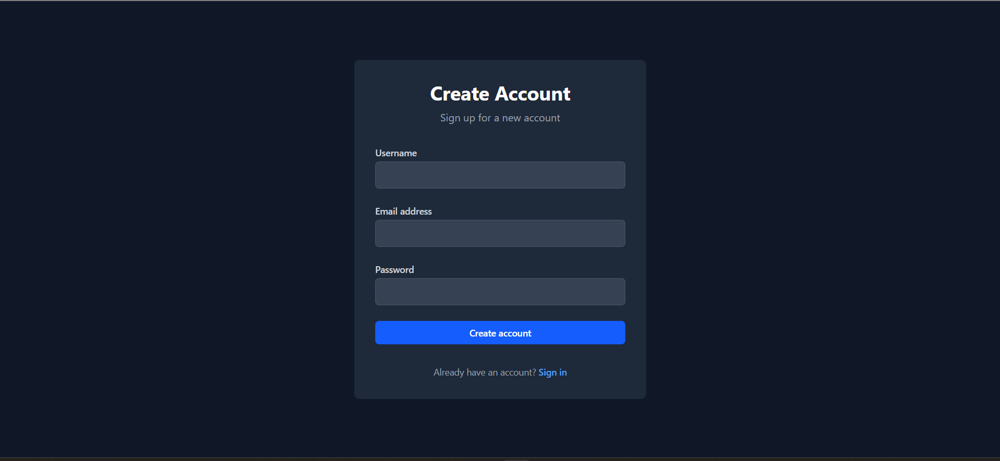
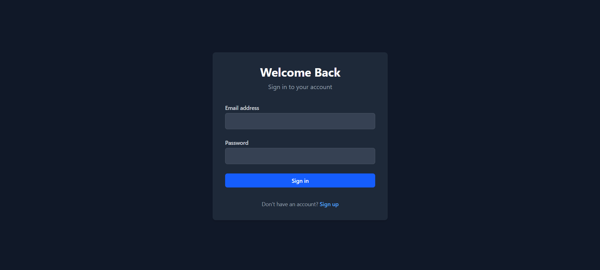

<!-- @format -->

# Full-Stack Real-Time Chat Application

This is a complete, full-stack real-time chat application built with a
modern MERN-stack variant: **React (with Vite)**, **Express**,
**Node.js**, and **WebSockets** instead of a traditional database for
this demo (though Mongoose models are included).

The project features a secure authentication system, responsive UI, and
real-time messaging with presence tracking and message statuses.

## Screenshots 📸

### Chats


_Main chat interface showing the contact list, live conversation, message status, and real-time user online indicators._

### Sign Up


_User registration page for creating a new account._

### Sign In


_Secure login page for user authentication._


## 🚀 Features

- **Secure User Authentication** --- bcrypt password hashing &
  JWT-based sessions
- **Protected Routes** (React Router)
- **Real-Time Messaging** using WebSocket (`ws`)
- **User Presence** --- online/offline indicators
- **Typing Indicators**
- **Message Statuses** --- sent, delivered, read (blue ticks)
- **Chat History & List View**
- **State Management** --- React Context API
- **Responsive UI** --- TailwindCSS

---

## 🛠️ Tech Stack

### Frontend

- **React 19** - UI library
- **TypeScript** - Type safety
- **Vite** - Build tool
- **Tailwind CSS 4** - Styling
- **React Router 7** - Routing
- **Axios** - HTTP client

### Backend

- **Node.js** - Runtime
- **Express 5** - Web framework
- **TypeScript** - Type safety
- **MongoDB** - Database
- **Mongoose** - ODM
- **JWT** - Authentication
- **Bcrypt** - Password hashing
- **Zod** - Input validation
- **Web Sockets** - Real time connection
- **CORS** - Cross-origin requests

## 📂 Project Structure

    ├── chat-app-backend/
    │   ├── src/
    │   │   ├── controllers/
    │   │   ├── middleware/
    │   │   ├── models/
    │   │   ├── routes/
    │   │   ├── utils/
    │   │   ├── websocket/
    │   │   ├── app.ts
    │   │   └── server.ts
    │   └── package.json
    │
    └── chat-app-frontend/
        ├── src/
        │   ├── context/
        │   ├── pages/
        │   ├── App.tsx
        │   └── main.tsx
        └── package.json

---

## ⚙️ Getting Started

### ✅ Prerequisites

- Node.js ≥ 18
- npm ≥ 9

### 🧠 Backend Setup

```bash
cd chat-app-backend
npm install
touch .env
```

`.env`:

    PORT=8000
    JWT_SECRET=your_super_secret_jwt_key

Run server:

```bash
npm run dev
```

### 💻 Frontend Setup

```bash
cd chat-app-frontend
npm install
npm run dev
```

Open browser at http://localhost:5173

## 🔌 API Endpoints

| Method | Endpoint                | Description           |
| ------ | ----------------------- | --------------------- |
| POST   | `/api/auth/register`    | Register              |
| POST   | `/api/auth/login`       | Login & get token     |
| GET    | `/api/auth/me`          | Validate user & token |
| GET    | `/api/chats`            | Get all chats         |
| POST   | `/api/chats`            | Create chat           |
| GET    | `/api/messages/:chatId` | Get messages          |

## 🌐 WebSocket Events

### Client → Server

- `join_chat`
- `chat_message`
- `typing`
- `stop_typing`
- `read_receipt`

### Server → Client

- `auth_success`
- `online_users`
- `user_status`
- `receive_message`
- `message_status_update`
- `typing`
- `stop_typing`
- `error`

## ✅ Done! Start Chatting 🎉

Register, login, and enjoy real-time chat 🎯
